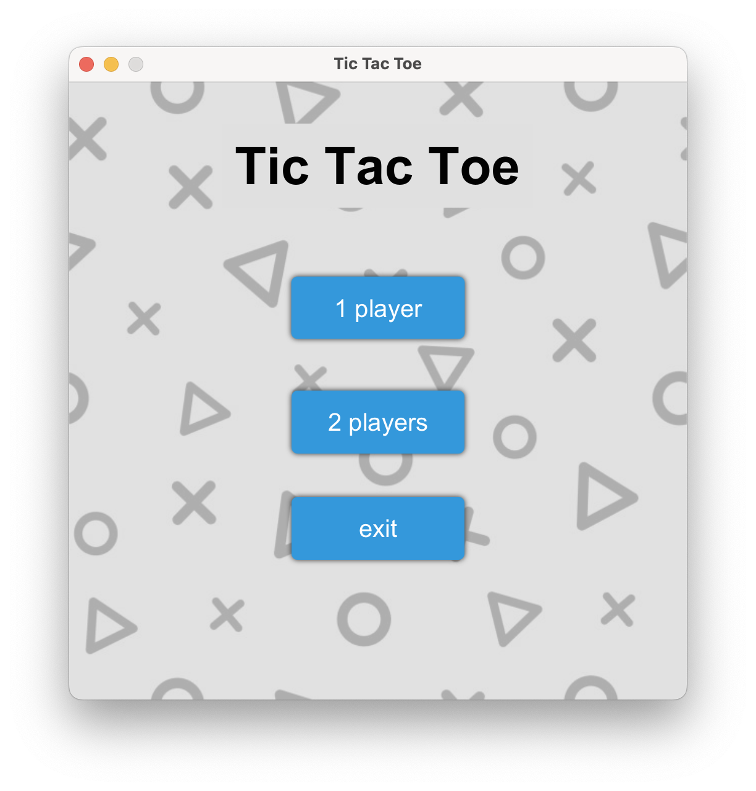
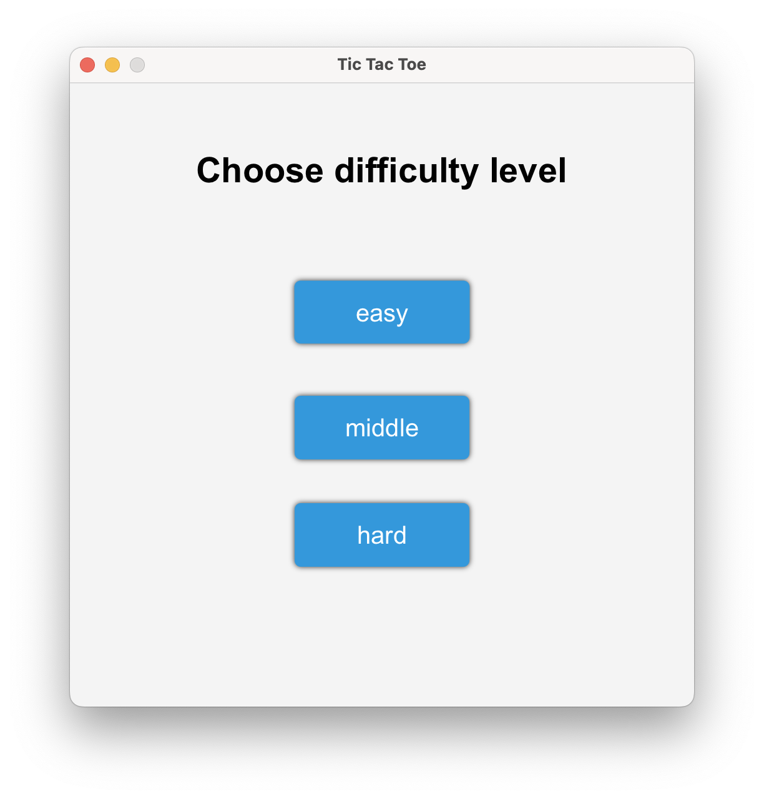
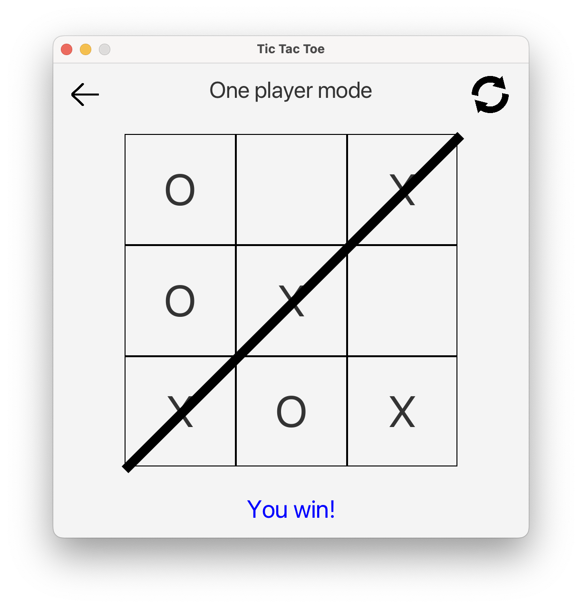
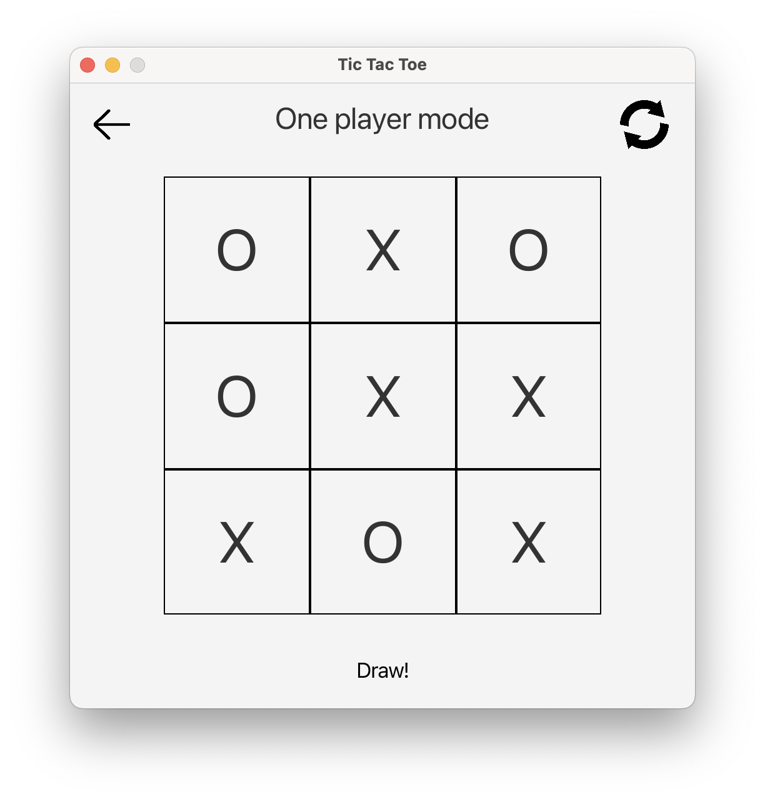

# JavaFX Tic Tac Toe

JavaFX Tic Tac Toe is a classic board game implemented using Java and JavaFX. This application allows players to enjoy the game both in single player mode against the computer and in two player mode.

## Screenshots of gameplay

## Description
**Game modes**: Supports single player play with bots of various difficulty levels (easy, medium, hard) and multiplayer play on one device.

**Graphical User Interface**: Intuitive and attractive GUI based on JavaFX.

**Cross-platform**: Works on any Java-enabled system

## Structure

- **com.example.tictactoe**: main folder with project source code.
  - **bots**: the folder contains implementations of artificial intelligence for bots that will play against the player.
    - **Bot**: interface that every bot must implement.
    - **EasyBot**: bot with a primitive strategy.
    - **MiddleBot**: bot with a complicated strategy.
  - **controllers**: mainly controllers for FXML are located here.
    - **GameController**: an abstract class that every controller that contains a game must inherit.
    - **MainMenuController**: responsible for the main menu of the game.
    - **ChooseLevelController**: is responsible for choosing the difficulty of the game in single player mode.
    - **SingleGameController**: inherited from GameController, responsible for single player mode.
    - **MultiplayerGameController**: inherited from GameController, Inherited from Game Controller, responsible for the two-player game mode.
  - **game**: contains important elements of game logic.
    - **Cell**: square of the tic-tac-toe game field.
    - **Game**: responsible for changing the course of the game and the gameplay in general.
    - **SingleGame**: inherited from Game performs the same functions, but with specifics for a single player game.
    - **BotLevel**: enumeration bot difficulty levels.
    - **Player**: enumeration of players.
    - **Winner**: enumeration of possible winners.
    - **WinLine**: enumeration of possible winning combinations.
  - **utilities**: some utilities that help simplify the management of various components.
    - **InfoBar**: controls bar status information during the game.
- **resources**: project resources folder.
  - **com.example.tictactoe**: contains FXML files to display scenes during the game.
  - **images**: contain icons necessary for the game.
  - **styles**: contains CSS styles.